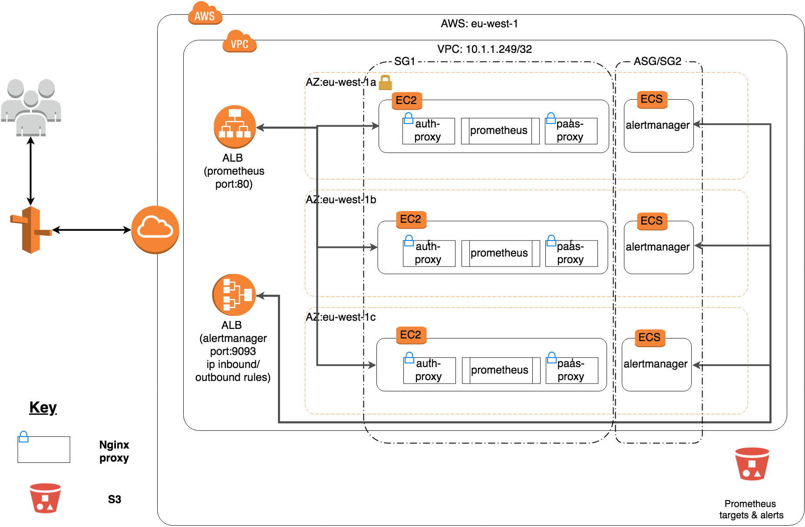
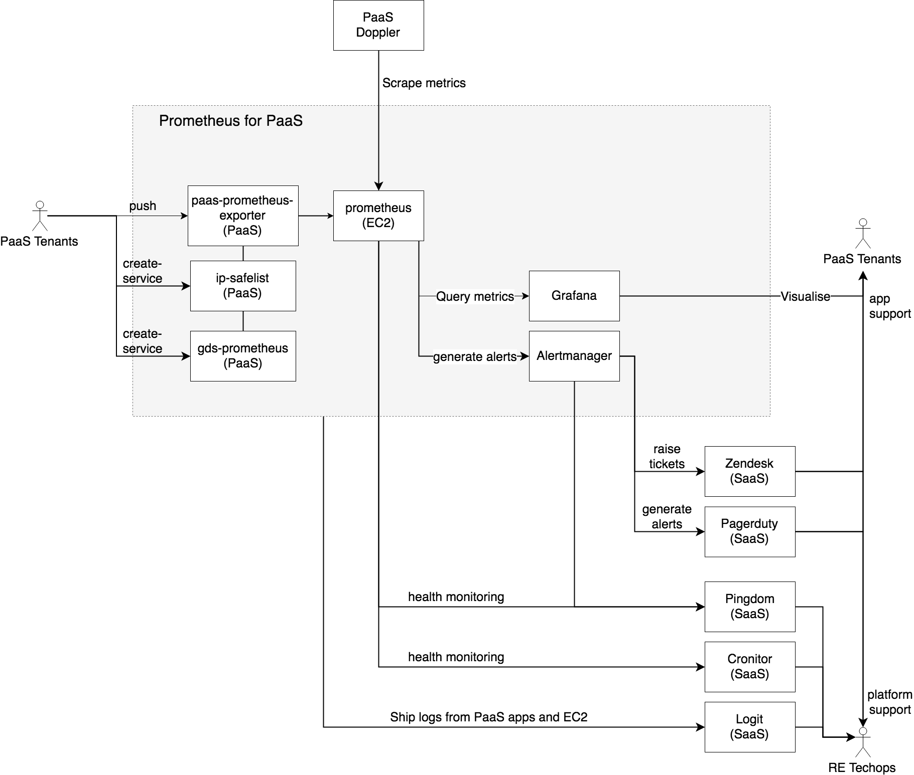
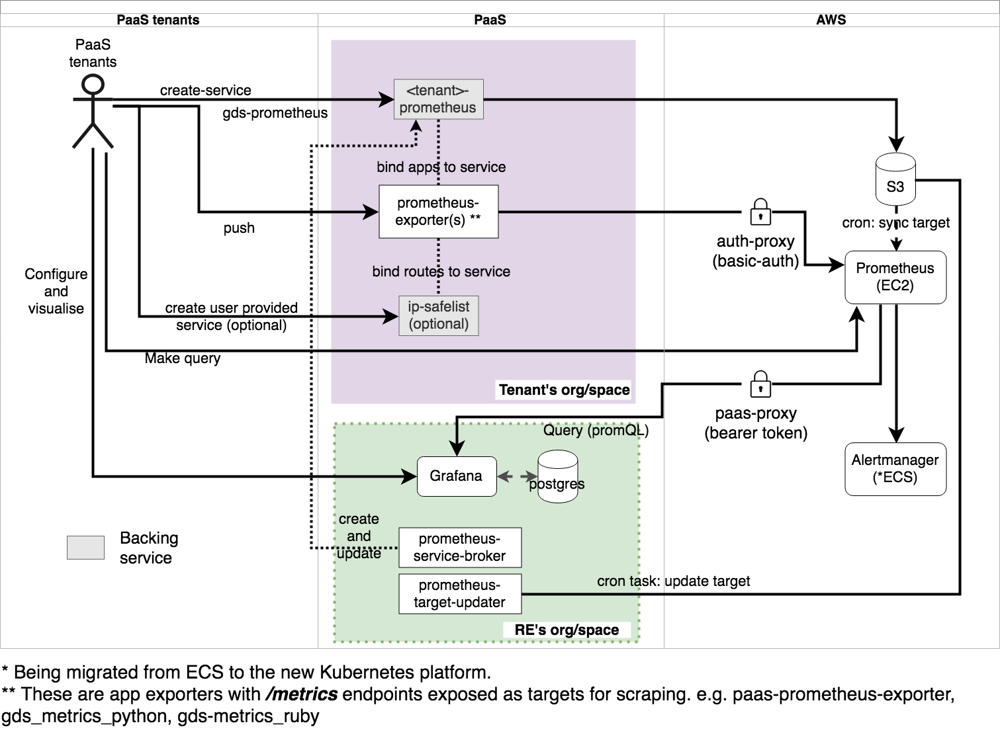

Automate operate a Prometheus service for GDS PaaS tenants, and are responsible for the support and reliability of the service.

## Overview
The following architecture documentation and diagrams applies to the RE-hosted Prometheus deployed by the Reliability Engineering team for GOV.UK PaaS services/ tenants (Prometheus-for-PaaS).

The Prometheus-for-PaaS suite (The Prometheus suite) includes Prometheus, Grafana and Alertmanager. Prometheus and Alertmanager is hosted on AWS and Grafana is hosted on GOV.UK PaaS.

The major development milestones are summarized as follow:


####Year/Quarter: 2018/Q1

Alpha [Previous docs](https://github.com/alphagov/monitoring-doc/tree/master/diagrams)

- Self hosted and configured a prometheus instance on AWS EC2
- Deployed nginx auth-proxy and paas-proxy on the same EC2 machines
- Developed exporters to expose apps and service metrics to be scraped by prometheus
- Developed PaaS service-broker for the exporters for PaaS tenants to export their metrics to Prometheus

####Year/Quarter: 2018/Q2-3

Beta [Previous docs](https://docs.google.com/document/d/1FFT6lqOknXNYfGYptTJ8E-8LPdroN7jvTQACSjjBUtU/edit#heading=h.iznzu7xflj1)

- Deploy 3 instances of Prometheus on AWS ECS
- Deployed 3 instances of Alertmanager on AWS ECS
- Deployed 1 instances of Grafana on GOV.UK PaaS
- Configure metrics and logs monitoring for the service
- Later migrate Prometheus and nginx processes from ECS to EC2
- Successfully tested 2 instances of Alertmanager running on the new Kubernetes platform
- Started migration of Nginx auth-proxy and paas-proxy back from ECS to EC2


## Architecture

[Architectual Drawings](https://www.draw.io/#G1JpBMth6oryBkCKBirF6n51q9yQC6kRIO)


Figure 1: Architecture for components hosted on AWS

**Description and Notes:**

- Three instances of Prometheus, Alertmanager are deployed over three AWS availability zones in Ireland (eu-west-1) for resilience and high availability (figure 1).
- URLs for these instances are:
  - Prometheus: [prom-1][prom-2][prom-3]
  - Alertmanager: [alert-1][alert-2][alert-3]
  - Grafana: [grafana]
- Each Prometheus instance has its own persistent EBS storage. Each instance is independent to each other and scrapes metrics separately.
- The three Prometheis are not load-balanced and each have their own public URL, routed by the ALB according to the request URL (prom-1, prom-2, prom-3)
- The ALB for Alertmanager route traffic to the corresponding Alertmanager according to the request URL. The inbound requests are also restricted to office IP addreses only. It does not load-balance the traffic.
- Deployment of Prometheus requires persistance storage (EBS).
- The alerts are configured and generated in Prometheus.
- Each Prometheus routes their alerts to all three of the Alertmanagers.
- The meshing of Alertmanagers (to remove duplication of alerts) does not work on ECS. This is because ECS only support one port per instances and Alertmanagers require two ports to function properly. One port for meshing and one port for alerting.
- One instance of Grafana and a Postgres database (small-9.5) is deployed on GOV.UK PaaS. It is uses prom-1 as a data source.
- The plan is to migrate Alertmanager from AWS ECS to GDS new Kubernetes platform.
- The Promethius are deployed via Docker and the configurations of Prometheus for PaaS is stored in a S3 bucket.


### System Boundary


Figure 2: System boundary diagram for Prometheus for PaaS - interaction with external systems and services.


### Integration with GDS PaaS applications


Figure 3: Interaction between PaaS tenants and Prometheus hosted on PaaS and AWS and service discovery

- Tenants deploy [Prometheus exporters](#exporter) on PaaS to export container-level, app and service metrics on PaaS with */metrics* endpoints to be scraped.
- Tenants create a service using the gds-prometheus service broker and bind apps to the service.
- If the tenants wish to restrict the web requests with IP safelist, they can deploy the [ip-safelist route service](#safelist) and bind application routes to the service. This step is optional.
- PaaS tenants can use the Prometheus GUI to query the metrics.
- PaaS tenants can use Grafana to create dashboards for the metrics and configure additional targets to be scraped for their organisations.

### Service discovery
- Service discovery allows Prometheus-for-PaaS to discover which [targets](https://prom-1.monitoring.gds-reliability.engineering/targets) on PaaS to scrape.
- A service broker, named “gds-prometheus”, is available to GDS PaaS tenants and is deployed from the [cf\_app\_discovery](https://github.com/alphagov/cf_app_discovery) code base .
- [cf\_app\_discovery](https://github.com/alphagov/cf_app_discovery) is an app written in Ruby, which is composed of two elements:
  - prometheus-service-broker: a Sinatra app that listens to calls made by the CloudFoundry service API when applications bind to or unbind from the service; and
  - prometheus-target-updater: a cron job that runs every five minutes to detect apps that have been stopped, scaled or killed
- PaaS tenants create a service with the gds-prometheus service broker and bind the apps to the service.  This will register and update the targets to be scraped by Prometheus.
- Both processes write JSON files to an S3 bucket which detail the target to monitor, the label to use for the metrics, and the application guid which is used by the instrumentation libraries to protect the /metrics endpoint on the app via basic auth.
- A cron job running on each Prometheis instances syncs these files to the config directory so that Prometheus can pick up the changes.

### AWS Nginx configuration
Nginx is set up infront of Prometheus and acts as an ingress/egress request proxy. It is composed of two elements:

#### paas-proxy:
A forward proxy is used for the traffic from Prometheus to PaaS with two purposes.

- **Custom header insertion**:
custom headers X-CF-APP-INSTANCE, which is a CloudFoundry-specific header which requests a specific instance ID to scrape, is inserted to requests from Prometheus to PaaS so that Prometheus can get metrics from each instance of an app - [EC2 Nginx config](https://github.com/alphagov/prometheus-aws-configuration-beta/blob/master/terraform/modules/prom-ec2/prometheus/cloud.conf#L66).

- **Bearer token**:
set to be CloudFoundry app guid, is used to authorise the connection to the /metrics endpoint for metrics exporters running on PaaS - [EC2 Nginx config](https://github.com/alphagov/prometheus-aws-configuration-beta/blob/master/terraform/modules/prom-ec2/prometheus/cloud.conf#L67).

#### auth-proxy
TO DO

### AWS session manager
We use AWS session manager for accessing AWS node instances via the [systems manager console](https://eu-west-1.console.aws.amazon.com/systems-manager/home?region=eu-west-1#) (login to aws first) or CLI. We do this instead of sshing into the node and do not need a bastion host in our architecture.

### IP safelist for PaaS routes
PaaS tenants can optionally deploy a [IP safelist service](https://docs.cloud.service.gov.uk/deploying_services/route_services/) on PaaS, which is based on [PaaS route service](https://docs.cloud.service.gov.uk/deploying_services/route_services/#route-services) that provides a full proxy for application routes, e.g. [prometheus-metric-exporter](https://github.com/alphagov/paas-prometheus-exporter) that are bound to it. PaaS tenants can use the route service to provide an IP restriction layer before web requests hit the applications running on PaaS.

### Logging, monitoring and alerting
The following apps and SaaS are used for monitoring, logging and alerting for the prometheus-for-PaaS.

#### Pingdom
Pingdom checks the availability of prom-1 every minute. Alertmanager can not be checked by Pingdom because only traffic from the office IPs can access it.

#### Logit
We send logs generated from AWS EC2 and PaaS to [Logit](https://reliability-engineering.cloudapps.digital/logging.html#get-started-with-logit), which provides an ELK (Elasticsearch/Logstash/Kibana) service for storing, visualising and filtering logs.

#### Prometheus and Alertmanager
We use Prometheus for GDS PaaS to monitor and alert on itself. Most applications we run expose a /metrics page by default, for example
[Grafana](http://grafana-paas.cloudapps.digital/metrics), [Prometheus](https://prom-1.monitoring.gds-reliability.engineering/metrics), [Alertmanager](https://alerts-1.monitoring.gds-reliability.engineering/metrics). We also run additional exporters where needed, for example the [node_exporter](https://github.com/prometheus/node_exporter) on our AWS EC2 instances.

#### Cronitor
[Cronitor](https://cronitor.io/) is a “Deadman Switch” type of service for health and uptime monitoring of cron jobs. Regular “heartbeats” are sent to Cronitor indicating uptime, it will raise a Pagerduty ticket if it misses the number of heartbeats as configured. We use this to page us if our alerting pipeline is not working.

#### Zendesk and Pagerduty
Zendesk is used for receiving non-interrupting alerts and Pagerduty is used to receive interrupting alerts. Alert priority is defined in the Prometheus alerts. Alertmanager is used for routing the tickets and pages to the services. The alerting actions and procedures are defined in Zendesk and Pagerduty. Refer to [gds-way](https://gds-way.cloudapps.digital/standards/alerting.html#how-to-manage-alerts) for information on managing alerts.


## Repositories

###Infrastructure, service discovery and secrets

| Repositories | Description |
| -------- | -------- |
| [prometheus-aws-configuration-beta](https://github.com/alphagov/prometheus-aws-configuration-beta)      | Terraform configuration to run Prometheus, Alertmanager and nginx on AWS EC2 and ECS with supporting infrastructure such as S3.    |
| [re-secrets](https://github.com/alphagov/re-secrets) | Contain secrets used for Prometheus-for-PaaS |
| [cf\_app\_discovery](https://github.com/alphagov/cf_app_discovery)| Cloud Foundry service broker (“gds-prometheus”), that acts as a service discovery agent and updates a list of targets apps to be scraped by Prometheus-for-PaaS. Tenants bind their apps to the service to be discovered by RE Prometheus-for-PaaS.|
|[grafana-paas](https://github.com/alphagov/grafana-paas)|Grafana configured to be deployed to GOV.UK PaaS|

###<a name="exporter">Metric exporters for Prometheus</a>

| Repositories | Description |
| -------- | -------- |
|[paas-prometheus-exporter](https://github.com/alphagov/paas-prometheus-exporter)| Expose container-level app metrics and some backing service metrics for the org that this exporter has access read right to. It reads the metrics from PaaS Doppler component.|
|[gds\_metrics\_dropwizard](https://github.com/alphagov/gds_metrics_dropwizard)|Expose apps metrics developed with Dropwizard.|
|[gds_metrics_python](https://github.com/alphagov/gds_metrics_python)|Expose app metrics for Python based apps|
|[gds_metrics_ruby](https://github.com/alphagov/gds_metrics_ruby)|Expose app metrics for Ruby based apps|


###<a name="safelist">IP Safelist proxy service for PaaS services</a>

| Repositories | Description |
| -------- | -------- |
| [re-paas-ip-safelist-service](https://github.com/alphagov/re-paas-ip-safelist-service)     | Cloud foundry route service (an nginx) that implement an IP safelist (whitelist) for Prometheus and GDS office IPs to access /metrics endpoints     |

###Documentation

| Repositories | Description |
| -------- | -------- |
| [re-team-manual](https://re-team-manual.cloudapps.digital/)     | Team manual for internal use, including but not limited to rituals, incident process and runbooks.     |
|[reliability-engineering](https://github.com/alphagov/reliability-engineering)|Maintain the [metrics and logging](https://reliability-engineering.cloudapps.digital/monitoring-alerts.html#metrics-and-alerting) section of the reliability engineering manual. |

## Access infrastructure

### Access to AWS

Our AWS account ids are as follows.

#### Dev Stack
re-prometheus-dev = 931679966755

To be granted "assume role" to this dev stack as admin you need to be added to the [re-prometheus-dev repo](https://github.com/alphagov/gds-user-accounts/blob/master/terraform/modules/prometheus-users/main.tf)

example .aws/config

```
[profile re-prometheus-dev]
region = eu-west-1
source_profile=fredbloggs
role_arn=arn:aws:iam::931679966755:role/fred.bloggs-admin
mfa_serial=arn:aws:iam::1234567890123:mfa/fred.bloggs@digital.cabinet-office.gov.uk
```

#### Production and Staging Stacks

re-prometheus-production = 455214962221

re-prometheus-staging    = 027317422673

example .aws/config

```
[profile re-prometheus-staging]
region = eu-west-1
source_profile=fredbloggs
role_arn=arn:aws:iam::027317422673:role/Administrator
mfa_serial=arn:aws:iam::1234567890123:mfa/fred.bloggs@digital.cabinet-office.gov.uk

[profile re-prometheus-production]
region = eu-west-1
source_profile=fredbloggs
role_arn=arn:aws:iam::455214962221:role/Administrator
mfa_serial=arn:aws:iam::1234567890123:mfa/fred.bloggs@digital.cabinet-office.gov.uk
```

#### AWS EC2 Access
Access to our EC2 instances is detailed within [EC2 Access](https://github.com/alphagov/prometheus-aws-configuration-beta).

### Access to Paas

Paas information can be found at [Paas](https://docs.cloud.service.gov.uk/).

  - The spaces that are relevant to Observe are:-
    - prometheus-grafana (production grafana)
    - prometheus-production
    - prometheus-staging

### Access to our secrets

Our secrets and passwords are stored within [github](https://github.com/alphagov/re-secrets/tree/master/observe). Our specific secrets are in re-secrets/observe.

### Access restrictions

Prometheus is accessible by office IP safelisting and then falls back to basic auth. Basic auth details are held in [re-secrets](https://github.com/alphagov/re-secrets/tree/master/observe).

Alertmanager is accessible by office IP safelisting but does not fall back to basic auth.

The office IPs can be found here [GDS Internal IP Network](https://sites.google.com/a/digital.cabinet-office.gov.uk/gds-internal-it/news/whitechapel-sourceipaddresses?pli=1).


## Support
### Support hours

The Automate team offer in work hours support, during 9am - 6pm, Monday to Fridays. Any issues out of hours will be recorded and handled during work hours.

### Support process and tasks

- Keep interruptible documentation up to date
- Respond to PagerDuty alerts
- Support users on the `#re-prometheus-support` and `#reliability-eng` slack channels
- Report any problems on the `#re-prometheus-support` and `#reliability-eng` slack channels with regular updates
- Check emails for Pingdom notifications
- Check emails for Logit and PagerDuty status updates
- Check on the status of the Prometheus service
- Check [Zendesk queue](https://govuk.zendesk.com/agent/dashboard) for tickets
- Triage issues and bugs
- Initiate the [incident process](#incident-process)

#### Keep interruptible documentation up to date

Keep the documentation for how to support this service up to date.

#### Respond to PagerDuty alerts

PagerDuty is configured to ring the Interruptible phone when an alert is triggered. PagerDuty alerts should be acknowledged and investigated.

#### Support users on the `#re-prometheus-support` and `#reliability-eng` slack channels

Users of the monitoring service can request help on the `#re-prometheus-support` and `#reliability-eng` slack channels, as interruptible you should be monitoring the channel and engage with users.

- help solve the users problem if it is simple
- [triage](#triage-process) the users problem if it is an issue or bug
- keep the user updated with progress

#### Check emails for Pingdom notifications

- check that each prometheus and alert managers endpoints are reachable.
- if not then check if there are any reported issues on PagerDuty and raise one if not and follow the [triage process](#triage-process).

#### Check emails for Logit and PagerDuty status updates
- inform `#reliability-eng` on slack and send something in the reliability engineering announce email group

#### Check on the status of the Prometheus service

Periodically:

  - Monitor the Prometheus benchmark (beta) dashboard on Grafana
  - Check the Prometheus targets on the active Prometheus dashboard

#### Triage issues and bugs

If you spot what could be an issue or bug then investigate following the [triage process](#triage-process).

### Triage process
One of the goals is to capture which tasks are being performed whilst on the interruptible duty.

It is important that tasks are recorded in [Trello](https://trello.com/b/Z7dOu9Up/re-observe-team) cards so that we understand what tasks are being performed and how long they take, the card should have the label `Interruptible`.
This information is important so that we can feedback and improve the process.

When triaging an issue you should take some time to ask the following questions:

- is someone else already looking at the issue
  - slack the `#re-autom8` channel, ask the team and look at existing Trello cards.
- what impact is it having on tenants:
  - High - does it affect their services, i.e. cause problems with deployments, affects performance of their apps.
  - Mid - does it impact their metrics collection, i.e. see unexpected gaps in metrics, or odd values, loss of historical metrics.
  - Low - is it causing problems in viewing metrics on Grafana, but metrics are still being collected and stored.
- how long will the issue take to resolve
  - get estimate from the person who is working on resolving the issue.
  - update the tenant(s) affected with progress.

Ideally you will not need to spend more then 30 minutes finding the answers.

If it is a new issue, and no one else is aware of it then create a [Trello](https://trello.com/b/Z7dOu9Up/re-observe-team) card adding the details you have found and add the appropriate label.

Talk to the team and decide who is going to be responsible for fixing the issue.

### Incident process

- Identify if our users are being affected
- Inform our users on `#re-prometheus-support` for Prometheus, `#reliability-eng` for Logit or team specific channels for issues only affecting a single team.
- If an incident has not already been created on PagerDuty then create one.
- Triage and technical investigation.
- Gather and preserve evidence.
- Resolution, update users that the issue has been resolved.
- Closure, organise a team incident review.

## Reliability

### User expectations

The most important events for our users are:

- their metrics can be successfully scraped by Prometheus
- they can access their dashboards in Grafana
- alerts are delivered to their receivers

This is the minimum so our users can be alerted to problems with their system and debug/monitor them.

We also consider the following important but not as critical for our users:

- access to the Prometheus user interface (most functionality is available in Grafana)
- access to the Alertmanager user interface (currently rarely used by our users)
- alerting rules quickly reviewed and deployed to Prometheus (this is a rare process with little evidence seen so far that quick review and deployment of alerts is essential for users)

Note, these lists may not be exclusive and are expected to change as our system develops.

### Service Level Indicators and Objectives (SLIs and SLOs)

We measure, monitor and alert on our most important user events using SLIs and SLOs. Our SLIs are defined and measured on our [Grafana SLI dashboard](https://grafana-paas.cloudapps.digital/d/wIbJBWbmz/re-observe-slis?orgId=1).

We still need to define and implement SLIs for all of our most important user events (see above). We still need to define SLOs for our SLIs and set up corresponding monitoring and alerting for this. Until these are done we may not find out if we are not meeting our users expecations of our service levels.


## Alerts

### RE_Observe_AlertManager_Below_Threshold

The current number of Alertmanagers running in production has gone below two.

1. Check using the AWS console that there are sufficient number of running ECS instances (Auto Scaling Group self healing).
2. Check using the AWS console if the ECS Alertmanager tasks are trying to start and are failing to do so.
3. Check the ECS logs for the Alertmanager services - these can be found in the ECS console.

#### Links

- [Alert definition](https://github.com/alphagov/prometheus-aws-configuration-beta/search?q=RE_Observe_AlertManager_Below_Threshold)

### RE_Observe_No_FileSd_Targets

Prometheus has no targets via file service discovery for the GOV.UK PaaS.

Check the [S3 targets bucket](https://s3.console.aws.amazon.com/s3/buckets/gds-prometheus-targets/?region=eu-west-1&tab=overview) in the GDS Tech Ops AWS account to ensure that the targets exist in the bucket.

If there are files in the targets bucket then:

1. Check the [Prometheus logs][] for errors.
2. SSH onto Prometheus and check if the target files exist on the instance.

If there are no files in the targets bucket then:

1. Check the [service broker logs][] for errors.
2. Check the `prometheus-service-broker` and `prometheus-target-updater` are running by logging into the PaaS `prometheus-production` space.

#### Links

- [Grafana: Prometheus](https://grafana-paas.cloudapps.digital/d/G-AIv9dmz)
- [Grafana: Service broker](https://grafana-paas.cloudapps.digital/d/JFAHBG1ik)
- [Alert definition](https://github.com/alphagov/prometheus-aws-configuration-beta/search?q=RE_Observe_No_FileSd_Targets)

### RE_Observe_Prometheus_Below_Threshold

The current number of Prometheis running in production has gone below two.

1. Check the status of the Prometheus instances in EC2.
2. Check the [Prometheus logs][] for errors.

#### Links

- [Grafana: Prometheus](https://grafana-paas.cloudapps.digital/d/G-AIv9dmz)
- [Alert definition](https://github.com/alphagov/prometheus-aws-configuration-beta/search?q=RE_Observe_Prometheus_Below_Threshold)

### RE_Observe_Prometheus_Disk_Predicted_To_Fill

The available disk space on the `/mnt` EBS volume is predicted to reach 0GB within 72 hours.

Look at [Grafana for the volume's disk usage](https://grafana-paas.cloudapps.digital/d/xIhaZyJmk/prometheus-nodes) or the [raw data in Prometheus](https://prom-3.monitoring.gds-reliability.engineering/graph?g0.range_input=1d&g0.expr=node_filesystem_avail%7B%20mountpoint%3D%22%2Fmnt%22%2C%20job%3D%22prometheus_node%22%20%7D&g0.tab=0&g1.range_input=1d&g1.stacked=0&g1.expr=predict_linear(node_filesystem_avail%7B%20mountpoint%3D%22%2Fmnt%22%20%7D%5B12h%5D%2C3%20*%2086400)&g1.tab=0). This will show the current available disk space.

Increase the EBS volume size (base the increase on the current growth rate in the Prometheus dashboard) in [RE Observe Prometheus terraform repository](https://github.com/alphagov/prometheus-aws-configuration-beta/blob/fc476319f504ee8ede3cefca70fbf9d7137efb7b/terraform/modules/enclave/prometheus/main.tf#L53) code and then run `terraform apply`. When the instance is available `ssh` into each instance and run `sudo resize2fs /dev/xvdh` so that the file system picks up the available disk space.

#### Links

- [Alert definition](https://github.com/alphagov/prometheus-aws-configuration-beta/search?q=RE_Observe_Prometheus_Disk_Predicted_To_Fill)

### RE_Observe_Prometheus_High_Load

Prometheus query engine timing is above the expected threshold. It indicates Prometheus may be beginning to struggle with the current load. This could be caused by:

- too many queries being run against it
- queries being run which are too resource intensive as they query over too many metrics or too long a time period
- an increase in the number of metrics being scraped causing existing queries to be too resource intensive

Queries can originate from a Grafana instance, alerting or recording rules, or be manually run by a user.

If this issue occurs please notify and discuss with the team.

#### Links

- [Grafana: Prometheus](https://grafana-paas.cloudapps.digital/d/G-AIv9dmz)
- [Alert definition](https://github.com/alphagov/prometheus-aws-configuration-beta/search?q=RE_Observe_Prometheus_High_Load)

### RE_Observe_Prometheus_Over_Capacity

Prometheus query engine timing is above the expected threshold. It indicates Prometheus cannot cope with the load and is critically over capacity. This could be caused by:

- too many queries being run against it
- queries being run which are too resource intensive as they query over too many metrics or too long a time period
- an increase in the number of metrics being scraped causing existing queries to be too resource intensive

Queries can originate from a Grafana instance, alerting or recording rules, or be manually run by a user.

If this issue occurs please notify and discuss with the team.

#### Links

- [Grafana: Prometheus](https://grafana-paas.cloudapps.digital/d/G-AIv9dmz)
- [Alert definition](https://github.com/alphagov/prometheus-aws-configuration-beta/search?q=RE_Observe_Prometheus_Over_Capacity)

### RE_Observe_Target_Down

There is a Prometheus target that has been marked as down for 24 hours.

This alert is used as a catch all to identify failing targets that may have no related alert (of which there are several).

You should identify who is responsible for the target and check their alerting rules to see if they would have been notified of this. If they would not have received an alert because they do not have one set up then you should contact them.

If the target is a leftover test app deployed by ourselves then check with the team but we can likely delete the application if no longer needed or unbind the service from the app, either [manually](https://cli.cloudfoundry.org/en-US/cf/unbind-service.html) or by removing the service from the application manifest.

We have also seen a potential bug with our PaaS service discovery leaving targets for
blue-green deployed apps even after the old (also known as venerable) application has been deleted. If this is the case we should try and identify what caused it. If we can't figure out why, manually delete the file from the [gds-prometheus-targets bucket](https://s3.console.aws.amazon.com/s3/object/gds-prometheus-targets).

#### Links

- [Prometheus targets](https://prom-1.monitoring.gds-reliability.engineering/targets)
- [Alert definition](https://github.com/alphagov/prometheus-aws-configuration-beta/search?q=RE_Observe_Target_Down)

### RE_Observe_Grafana_Down

The Grafana endpoint hasn't been successfully scraped for over 5 minutes. This could be caused by:

1. A deploy is taking longer than expected.
2. An issue with the PaaS.

Check:

1. Check with the team to see if there is a current deploy happening.
2. Check the [non 2xx Grafana logs][]

#### Links

- [Alert definition](https://github.com/alphagov/prometheus-aws-configuration-beta/search?q=RE_Observe_Grafana_Down)

## Runbook

### There is a problem with the monitoring service (Prometheus or Alert Manager)
 - check if the services are available
 - check if there are any deployments in progress
 - check that [Grafana](https://grafana-paas.cloudapps.digital/) is pointing to a live Prometheus service by looking at the data sources under configuration.
 - check the health of the ECS cluster to make sure that the services are running in each AZ.

Escalate the issue to the rest of the team if you are unable to track down the problem.

If the issues are not affecting services  (Users are able to continue to use the service without any disruption) then follow the [triage process](#triage-process).


### There is a problem with one of the Prometheus tenants

Put a message in slack: `#re-prometheus-support` and speak to someone in the [team](https://docs.google.com/document/d/1WLKqmpSHUbOVygkdJkewM1bj7lOK0MC-r8sBpTIHBzs/edit) who is responsible for the service which has a problem.


### Adding and editing Grafana permissions

If a user requests a change in Grafana permissions, for example so that they can edit a team dashboard, then you should add that user to the relevant Grafana team and ensure that the team has admin permissions for their team folder.

Do not change a user's overall permissions found in **Configuration > Users** - this should remain as 'Viewer' for all users who are not part of the RE Observe team.

### Rotate basic auth credentials for Prometheus for PaaS

1. Create a new password, for example using `openssl rand -base64 12`

2. Save the plaintext password in the re-secrets store under `re-secrets/observe/prometheus-basic-auth`.

3. Hash the password:

    ```
    docker run -ti ubuntu
    apt-get update
    apt-get -y install whois
    mkpasswd -m sha-512
    ```

4. Append `grafana:` to your hashed password and save this in the re-secrets store under `re-secrets/observe/prometheus-basic-auth-htpasswd`.

5. Deploy Prometheus to staging. As this deploy changes the `cloud.conf` for our instances, you may need to follow steps
in the Prometheus README to deploy with zero downtime.

6. Update the basic auth password for the Prometheus staging data source in Grafana. You will need to do this for every
Grafana organisation.

7. Repeat step 5 for production. Note, as soon as this has been deployed to the main Prometheus that Grafana is using as
a datasource our users dashboards will start breaking as they will still using the old credentials.

8. Repeat step 6 for production.

9. Let users know via the #re-prometheus-support Slack channel that they may need to refresh any Grafana dashboards they
have open to use the new basic auth credentials.
